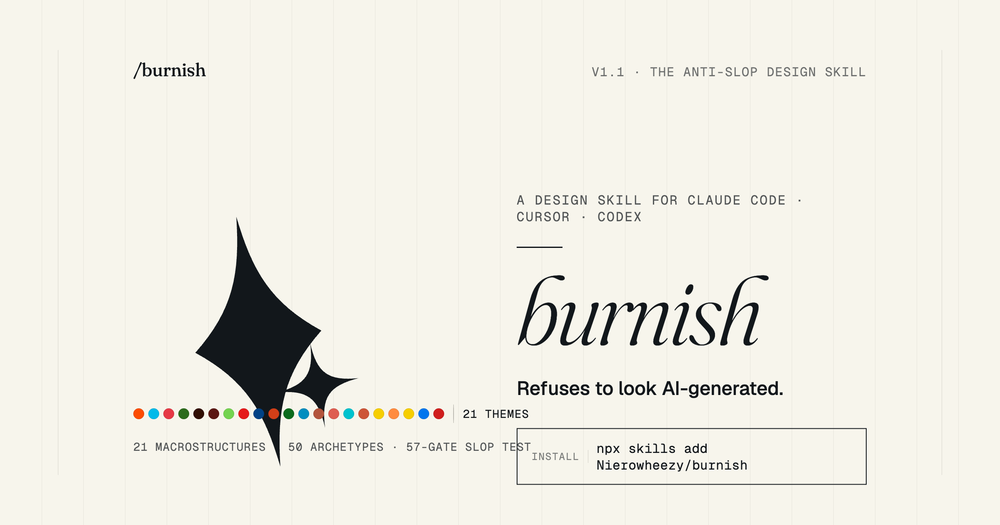
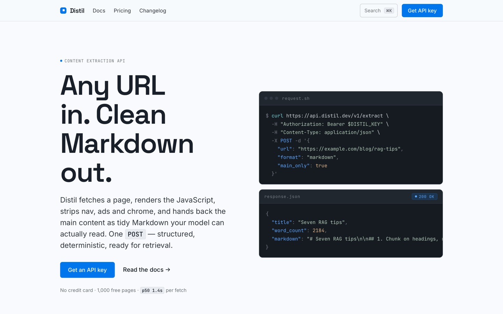
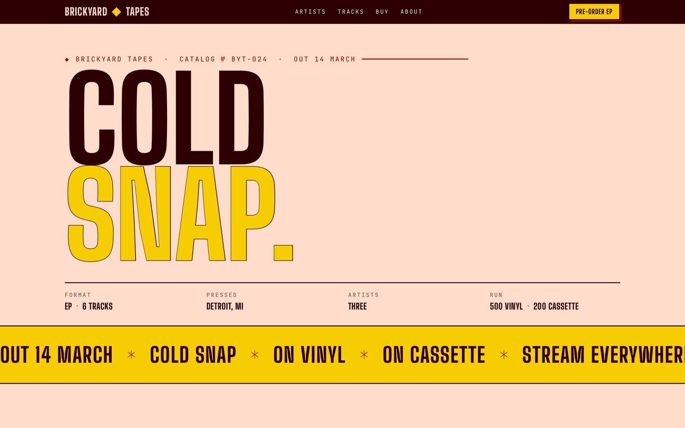
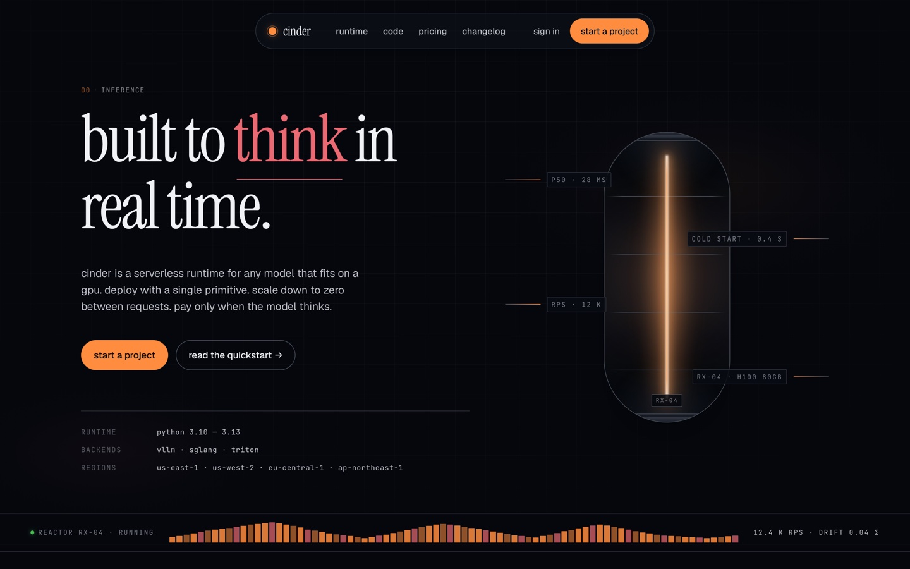
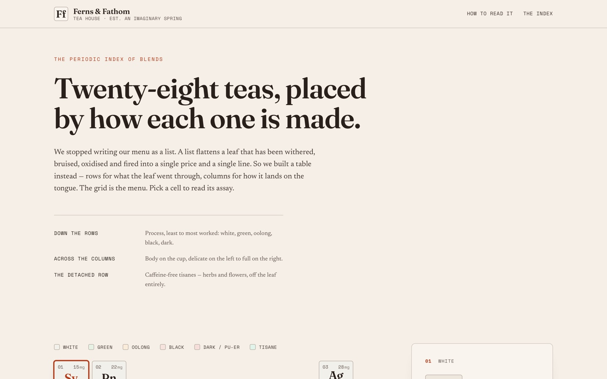
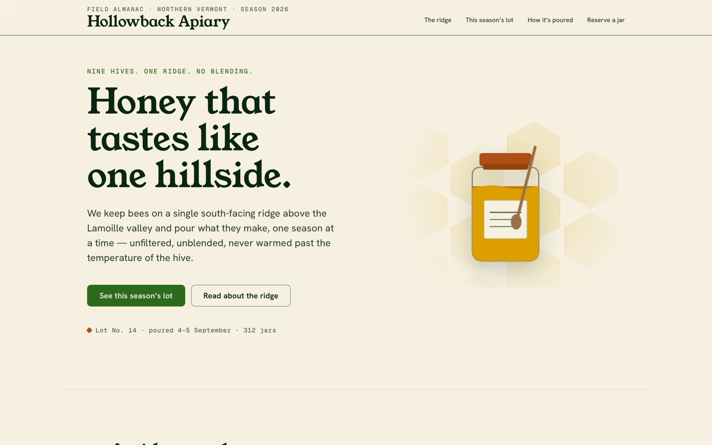
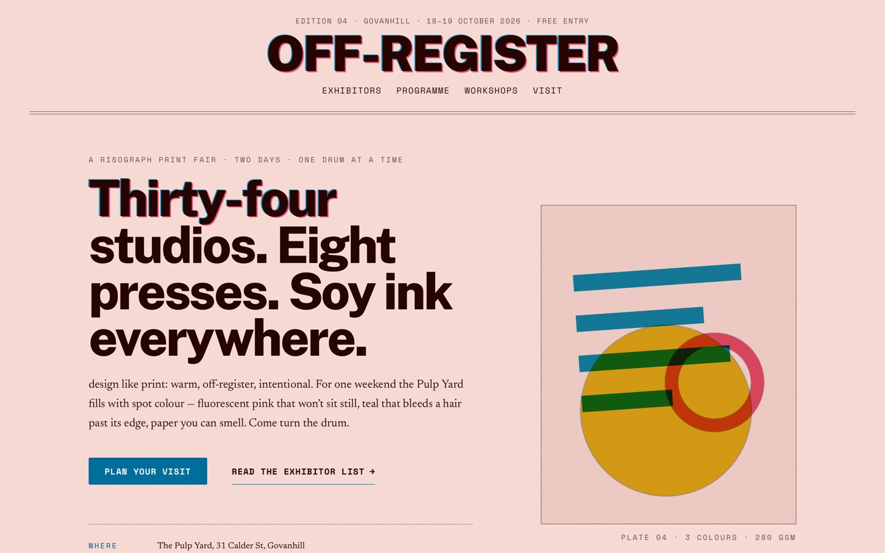
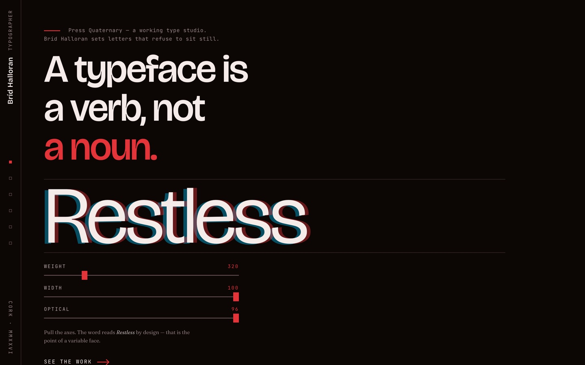

# Burnish

**A design skill for Claude Code, Cursor, and Codex that refuses to look AI-generated.**

[Live demo →](https://useburnish.vercel.app) &nbsp;·&nbsp; **v1.1.0** &nbsp;·&nbsp; MIT &nbsp;·&nbsp; twenty-one themes &nbsp;·&nbsp; four verbs &nbsp;·&nbsp; press `T` to cycle

<p align="center">
  
</p>

Burnish picks a macrostructure for the brief, dresses it in one of twenty-one themes, runs fifty-eight slop-test gates plus a pre-emit self-critique, and refuses the on-distribution defaults every LLM was trained into. Two pages by Burnish for two different briefs feel like different sites, not colour-swaps of the same template.

This is the shallow end. Everything below is what the skill can actually do.

---

## Table of contents

- [What makes it different](#what-makes-it-different)
- [Installation](#installation)
- [The four verbs](#the-four-verbs)
- [The design flow (how a build actually works)](#the-design-flow)
- [The twenty-one themes](#the-twenty-one-themes)
- [The four genres](#the-four-genres)
- [Custom themes](#custom-themes)
- [Component scope](#component-scope)
- [Disciplines that hold across every verb](#disciplines-that-hold-across-every-verb)
- [The slop test](#the-slop-test)
- [Project memory & diversification](#project-memory--diversification)
- [Portable `design.md` & exports](#portable-designmd--exports)
- [Hero enrichment](#hero-enrichment)
- [Proof: test suite & worked examples](#proof-test-suite--worked-examples)
- [Inside the repo](#inside-the-repo)
- [Reading list](#reading-list)
- [Roadmap](#roadmap)
- [Licence](#licence)

---

## What makes it different

Burnish is opinionated, short, and boring on purpose. It encodes a tight set of rules — drawn from the consensus of the anti-AI-slop design field (Anthropic's frontend-design skill, the Claude cookbook on frontend aesthetics, and the 2026 "tactile rebellion" movement) — and refuses to let the model fall back to the defaults every LLM was trained on.

The differentiator is **structural variety**, not just visual variety. Two pages by Burnish for two different briefs should not share the same `hero → 3-feature → CTA → footer` rhythm. They should feel like different sites — different *shapes* — not different colour-swaps of the same template.

At a glance, Burnish ships:

| | |
| --- | --- |
| **Four invocations** | build (default) · `audit` · `redesign` · `study` |
| **Twenty-one themes** | one catalogue, rotated by a diversification rule |
| **Twenty-one macrostructures** | complete page-shapes, picked *first* |
| **Fifty component archetypes** | 9 heroes · 5 section heads · 6 features · 4 CTAs · 4 testimonials · 8 footers · 14 navs |
| **Four genres** | editorial · modern-minimal · atmospheric · playful |
| **Fifty-eight slop-test gates** | a post-emit check nothing ships without |
| **Pre-emit self-critique** | six axes scored 1–5 before every handoff |
| **Eight interaction states** | every interactive element, every time |
| **Four export formats** | `tokens.css` · Tailwind v4 `@theme` · DTCG `tokens.json` · shadcn/ui vars |
| **Portable `design.md`** | lock a system and carry it between projects |
| **Project memory** | `.burnish/log.json` rotation + `.burnish/preflight.json` cache |
| **Custom themes** | tuned (palette + type) or bespoke (structure too), still gated |

---

## Installation

```sh
npx skills add Nierowheezy/burnish
```

Re-run any time to update. Or copy [`SKILL.md`](skills/burnish/SKILL.md) + [`references/`](skills/burnish/references/) into:

- **Claude Code**: `~/.claude/skills/burnish/`
- **Cursor**: `.cursor/rules/burnish.mdc` (body of `SKILL.md` — the part after the `---` frontmatter)
- **Codex**: `~/.codex/skills/burnish/` (personal) or `.codex/skills/burnish/` (project-scoped)

The rule-set lives in [`SKILL.md`](skills/burnish/SKILL.md) and [`references/`](skills/burnish/references/). Worked examples in [`docs/recipes.md`](docs/recipes.md) and [`docs/study-examples.md`](docs/study-examples.md).

---

## The four verbs

Burnish has one default behaviour and three explicit verbs.

| Invocation | What it does |
| --- | --- |
| *(default)* | Design or build something new. Runs the full **design flow** (below): pre-flight, one context question, macrostructure + theme pick, preview, build, slop test. |
| `burnish audit <target>` | Score existing code against the anti-pattern list and return a **ranked punch list**. Critical / major / minor, each with the named tell, the file + line range, and a one-line fix. **Never edits anything.** |
| `burnish redesign <target> [--mood <word>]` | Throw out the visual structure, keep the content. Preserves copy intent, information architecture, routes, component ownership, and working logic; replaces the structural fingerprint, component voice, and visual rhythm. |
| `burnish study <screenshot \| URL>` | Extract the **DNA** of a design you admire — macrostructure, archetypes, type-pairing, colour anchor. Produces a diagnosis report first, then offers to rebuild *your* content with that DNA, or lock it into a portable `design.md`. |

Anything that doesn't map to `audit`, `redesign`, or `study` is treated as a default build. If you attach an image or paste a URL without a verb prefix, Burnish asks whether you want to *study* it or treat it as a reference for a fresh build.

### Default — build new UI

```
"design a landing page for Nimbus, a weather API"
```

This is the full design flow. It answers nothing you haven't specified — it asks one context question, then shows you its reasoning at every decision point.

### `burnish audit`

```
burnish audit src/pages/landing.html
```

For each finding: **tell** (the named anti-pattern), **where** (file + line range), **severity** (critical / major / minor), **fix** (a one-line correction). Grouped by severity, ending with a count: `N critical · M major · K minor`.

The audit is aware of Burnish's own output — it checks stamps against reality (`stamp lies`), scopes gates to the active genre, and on a `design.md`-managed project checks for system drift and missing system references.

### `burnish redesign`

```
burnish redesign ./src      # multi-page (a directory → app-wide redesign)
burnish redesign landing.html --mood minimal, technical
```

Single-page flow replaces structure and keeps copy + IA + brand. Multi-page flow walks the whole project, writes a **`design.md`** at the root (the locked system), confirms it with you, then redesigns every page *reading from* that file. `design.md` wins over per-build references, and the diversification rule inverts — pages must share the system, not diverge from it. Any deletion requires explicit confirmation first.

### `burnish study`

```
burnish study https://example.com          # URL mode — exact fonts, exact colours
burnish study ~/Downloads/reference.png    # image mode — roles + rhythm, no pixels
```

`study` extracts **structure, not pixels**. Both modes share one output: a diagnosis report naming the macrostructure, the per-section archetypes, the type pairing, and the colour anchor. A detection protocol also tells you what *not* to carry over.

- **Image mode** reads the screenshot by vision: surface, type *roles* (it proposes candidate faces from a canon), structure, motion, and rhythm.
- **URL mode** fetches the page's HTML + CSS and can name **exact fonts and exact colour values** — but can't judge rhythm, and says so. Auth-walled pages, JS-only SPA shells, and template-marketplace URLs (ThemeForest, Webflow/Framer templates, Gumroad UI kits, Dribbble shots, Behance galleries…) are refused, with a fallback to asking for a screenshot. Remote URLs are safety-checked (`https` only, no localhost/IP literals, every redirect verified).

Three follow-ups after the diagnosis: **build with the DNA** (hands off to the default flow with the studied system locked), **`lock the DNA`** (emit a portable `design.md` — URL-mode emission requires you to attest the source is yours or a public reference for your brand), or **stop** — the diagnosis is already a complete deliverable.

---

## The design flow

Every default build runs this sequence. You don't need to memorise it — the skill does — but this is what's happening under the hood.

### Step 0 · Pre-flight scan

If the project already has code, Burnish **reads it before asking anything**: `design.md` (the locked system — it overrides everything), the font stack, the palette, the motion libraries, the spacing scale, the framework. It reports what it found with file:line citations, states what it will preserve vs. introduce, and caches the result to `.burnish/preflight.json` (re-scan on demand with *"refresh pre-flight"*). On an empty project it stays silent.

### Step 1 · Design-context gate

Burnish **always asks one question** before designing — Audience / Use case / Tone — even on a five-word brief. Answering is optional: *"go ahead"* has you covered, and when you skip it, Burnish infers, discloses what it inferred in one sentence, and lets you redirect.

This step also settles the **genre** — editorial (default), modern-minimal, atmospheric, or playful — from signal words in the brief. Genre scopes which themes can rotate, which gates apply, and which voice fixtures get picked.

### Step 2 · Pick a macrostructure first

Before any code, Burnish picks one of **twenty-one named macrostructures** — a complete page-shape (heading placement, body composition, divider language, button voice, image treatment, reveal):

01 Bento Grid · 02 Long Document · 03 Marquee Hero · 04 Stat-Led · 05 Workbench · 06 Conversational FAQ · 07 Manifesto · 08 Photographic · 09 Quote-Led · 10 Specimen · 11 Catalogue · 12 Letter · 13 Index-First · 14 Narrative Workflow · 15 Split Studio · 16 Feature Stack · 17 Type Specimen · 18 Portfolio Grid · 19 Map/Diagram · 20 Ecosystem Index · 21 Component Playground

Then it picks a **nav archetype** (fourteen: N1a minimal · N1b SaaS three-section · N2 floating chip · N3 side-rail · N4 hidden ⌘K · N5 floating pill · N6 masthead · N7 brutal slab · N8 terminal · N9 edge-aligned · N10 scroll-morph · N11 mega-menu · N12 banner + retract · N13 inline ⌘K-pill) and a **footer archetype** (eight: Ft1 mast-headed · Ft2 single-line rule · Ft3 index-style · Ft4 dense typographic · Ft5 statement · Ft6 letter-close · Ft7 newsletter-first · Ft8 marquee). It deliberately avoids the two most-recognised AI fingerprints (N1a, Ft3) unless the page genuinely calls for them.

It states every pick out loud — *"Macrostructure: Marquee Hero. Nav: N5. Footer: Ft5. Theme: Bloom."* — before writing code. That's an accountability step, not decoration.

### Step 2.5 · Check project memory

If this project has been built before, `.burnish/log.json` holds the last entries. Burnish reads the last 3–5 and rotates: your macrostructure must not repeat, your theme must differ on at least one of three axes, your nav/footer/enrichment must not repeat. It says the rotation out loud — the "why" is part of the output.

### Step 2.6 · Theme route

Three routes:

- **Catalog** (default, silent) — one of the 21 named themes, scoped to the genre's cluster and rotated per the diversification rule. Vanilla briefs never see the words "catalog" or "custom".
- **Custom** — fires only on a creative-intent signal (you name a brand colour, you ask for something made-to-measure, you attach a moodboard). Two depths: *tuned* (a one-off OKLCH palette + free-font pairing on Burnish's structures) or *bespoke* (palette, type, **and** structure designed from first principles). Every slop-test gate still fires either way.
- **Studied-DNA** — when you just ran `study` and said *"build with this DNA"*, the extracted system becomes the locked theme. Diversification suspends; you're following external DNA, not rotating.

### Step 3 · Load the visual ruleset

Burnish is disciplined about *what* it loads and *when* — eager files (genre + theme spec when one exists), index-then-pick files (macrostructure and component cookbook — never load the whole catalogue), universal per-build files (typography, colour, layout, motion, copy, anti-patterns), and conditional files (microinteractions, responsive, hero enrichment, custom craft — only when actually needed). The slop test is loaded **only at Step 7**, as a post-emit check.

### Step 4 · Decide on hero enrichment

Default is **typography-only** — the strongest hero is often a typographic one. When the brief points elsewhere (a SaaS wants a demo video, a bakery wants an illustration), Burnish climbs an enrichment hierarchy that never reaches above what it can hand-build:

> typography only → **Tier A** pure-CSS art → **Tier B** hand-built SVG → **Tier C** generated still → **Tier D** library + customisation → **Tier E** Lottie *(last resort — reaching for Lottie when CSS would have built it "is the new tell")*

It never ships invented stock photos as if they were final. Placeholders are marked; non-photographic imagery prefers the hand-built imagery kit.

### Step 5 · Preview

A tight, skimmable summary before any code — Macrostructure · Theme (+ palette summary) · Enrichment · Sections · Motion · Slop test (58/58 or which gates are open) · Diversification. Plus a quiet CTA: *"System portable? Say `lock the system`…"* You redirect here, before 500 lines of CSS get written.

### Step 6 · Build

Code is emitted to the project's own conventions. Unbreakable rules: OKLCH colours via named custom properties, a 4-pt spacing scale, a distinctive display face + refined body pairing, every interactive element designed in **all eight states**, `transform`/`opacity`-only animation with the three named easings, `prefers-reduced-motion` support, instant `:focus-visible` rings. Headlines are sized to copy length. Section-number eyebrows are off by default. The output carries a **stamp** at the top of the CSS (the durable record of what was picked) and **`tokens.css` is always emitted**. The global stylesheet of an existing project is **append-only** — never clobbered. Project memory (`.burnish/log.json`) is updated, newest entry first, trimmed to the last 20.

### Step 7 · The slop test

Fifty-eight gates run before anything ships. Every answer must be "no". If any gate fails, the skill fixes it and re-emits the preview with the corrected row. See [The slop test](#the-slop-test).

---

## The twenty-one themes

All output uses theme tokens: paper, ink, accent, fonts — every theme a full design system in OKLCH, not a hue-rotate of a default.

| Theme | Paper / default feel |
| --- | --- |
| **Specimen** | numbered margins, huge serif, asymmetric spans; the canonical editorial voice |
| **Atelier** | warm studio paper, hand-set serif |
| **Brutal** | raw, heavy CSS, slab letters, no ornament |
| **Newsprint** | roman serif on newsprint; the editorial default pair |
| **Studio** | gallery-white, chromatic-green accent |
| **Manifesto** | geometric sans, poster-led, polemic |
| **Terminal** | mono, phosphor; true terminal-aesthetic |
| **Midnight** | dark paper, cool ink-blue accent |
| **Almanac** | calendar/archive ledger on warm paper |
| **Garden** | botanical, leaf-green, light |
| **Riso** | risograph bold, ink-on-bright paper |
| **Sport** | display-condensed roman, stat-led energy |
| **Bloom** | animated, warm, atmospheric |
| **Coral** | modern-minimal, coral accent |
| **Cobalt** | modern-minimal, Space Grotesk + mono, ink-blue |
| **Aurora** | atmospheric, luminous blooms |
| **Editorial** | the named genre's own theme |
| **Carnival** | display-heavy, playful |
| **Lumen** | classical serif (Instrument Serif, upright), light |
| **Hum** | the default; Plus Jakarta Sans, warm humanist, soft light paper |
| **Grid** | architectural grid, hairline rules |

Themes rotate within **genre clusters**: atmospheric → Bloom / Midnight / Terminal / Aurora / Lumen · modern-minimal → Coral / Cobalt · playful → Hum · editorial → the remaining thirteen. The per-theme axis values (paper band · display style · accent hue) live as comments in [`site/css/tokens.css`](site/css/tokens.css), and the diversification rule forces consecutive outputs to differ on at least one axis — so you don't get two light-warm-serif pages in a row.

---

## The four genres

| Genre | Reads like | Fires on |
| --- | --- | --- |
| **editorial** *(default)* | canonical anti-slop voice | no signal; the default |
| **modern-minimal** | Stripe / Linear / ElevenLabs school | SaaS · enterprise · API · platform · dev tool · infra · B2B |
| **atmospheric** | Suno / Runway / dark-AI-tool school | AI tool · generative · music · video · voice · late-night · dark mode |
| **playful** | post-Linear soft school | fun · consumer · casual · friendly · onboarding · family · community |

Genre filters the theme cluster, the slop-test gates that apply, and the copy voice Burnish draws from.

---

## Custom themes

Two depths, gated behind a creative-intent signal (a named brand colour, a multi-attribute vibe, a moodboard, or an explicit *"make it ours"*), and **both bound by every slop-test gate**:

- **Tuned** — a made-to-measure OKLCH palette + free-font pairing built for the brief, on Burnish's structures. Palette construction is a real pipeline: anchor accent (clamped chroma) → paper (derived from the vibe's lightness) → ink → supporting greys → focus → accent-ink → gate verification. Worked examples: *Coffeebox* (archival café), *Loop* (industrial fintech), *Mossroot* (botanical apothecary).
- **Bespoke** — when the brief says *"from scratch"* or *"no theme"*, or a page-shape no catalogue macrostructure fits: palette, type, **and** composition designed from first principles. It drops the named-theme tokens and the diversification rotation, but keeps the non-negotiable floor — universal slop gates, contrast + a11y, `:focus-visible`, reduced-motion, semantic landmarks, alt text, the stamp + log.

The protocol lives in [`skills/burnish/references/custom-theme.md`](skills/burnish/references/custom-theme.md). Custom is a quiet branch: vanilla briefs never see the words "catalog" or "custom".

---

## Component scope

Most day-to-day dev requests are component-shaped, not page-shaped — *"a button"*, *"an input"*, *"this one card"*, *"just the modal"*. When two scope signals fire (a single element is named, the brief is short, the target is one component file), Burnish switches to the **component-scope flow**:

- **Same pre-flight, genre, theme route, and 2+1 font discipline** as a page.
- **Stricter state discipline.** Every interactive component ships code for **all eight states**: `default · hover · :focus-visible · :active · disabled · loading · error · success`.
- **Emits two files side by side**: the component artifact (consuming project tokens by name) plus an **8-state demo wrapper** (`<Component>.preview.html`) that renders all eight states stacked and labelled for one-time inspection — then gets deleted.
- **Skips** macrostructures, nav/footer archetypes, hero polish, and enrichment — the component *is* the artifact.
- Output stamp carries the states checklist: `/* Burnish · component: <type> · genre: <genre> · theme: <theme> · states: default · hover · focus · active · disabled · loading · error · success */`

Ambiguous briefs get one clarifying question — *"One pricing card, or the whole pricing page?"* — and default to component on silence, since a single artifact is cheaper to redirect than a multi-section page.

---

## Disciplines that hold across every verb

These six apply to every invocation — build, audit, redesign, study, component — not just one branch:

1. **Pre-emit self-critique.** Before handing back, score the output 1–5 on six axes — **Philosophy · Hierarchy · Execution · Specificity · Restraint · Variety**. Anything under 3 triggers a revision pass. The scores are stamped into the artifact. Two revision passes are normal; three means the brief is wrong.
2. **Honest copy — no fabricated content.** No invented metrics, testimonials, logos, or case-study counts. Unsupplied numbers are placeholders (`—` + a labelled grey block) or a different macrostructure. *"+47% conversion"*, *"trusted by 50,000+ teams"*, *"10× faster"* are slop the moment they're invented.
3. **Locked tokens — no mid-render improvisation.** Every colour and font in the artifact references a named token (`var(--color-accent)`, `var(--font-display)`). No inline OKLCH/hex bypassing the token block; if a needed value doesn't exist, it gets lifted into the tokens first.
4. **Re-drawn chrome forbidden.** No fake browser bars, fake phone frames, fake code-window chrome, or fake IDE bars — the user's environment already supplies real chrome. Real screenshots in a `<figure>` at most, or nothing.
5. **Mobile responsiveness — a hard floor.** Every emit is verified at 320 / 375 / 414 / 768 px: no horizontal scroll, never two-line clickable text, `minmax(0, 1fr)` image tracks, long-word-proof display headers, one-column section collapse.
6. **Typography purity — no italic headers.** Headings and display type are always roman. An italicised emphasis word in an upright heading is *the* AI tell. Emphasis is carried with weight, accent colour, or a drawn underline — italic survives only as body-copy emphasis.

---

## The slop test

Fifty-eight gates in [`skills/burnish/references/slop-test.md`](skills/burnish/references/slop-test.md) — every answer must be **no**. They run after the build, never before (that's what `anti-patterns.md` is for). Grouped:

| Group | Gates |
| --- | --- |
| Visual | 1–7 |
| Structural | 8–9 |
| Microinteractions | 10–19 |
| Variety | 20–21 |
| Implementation | 22–27 |
| Hero enrichment | 28–31 |
| Diversification | 32–33 |
| Layout safety | 34–36 |
| Typography discipline | 37 · 38 · 38a |
| Input state | 39 |
| Contrast & readability | 40–41 |
| Nav / footer / hero structural slop | 42–45 |
| Honest copy | 46 |
| Re-drawn UI chrome | 47 |
| Token discipline | 48 |
| Responsive clickable affordances | 49 |
| Mobile non-negotiables | 50–57 |

A few gates adapt by genre: atmospheric allows radial bloom treatments (but never gradient text), modern-minimal allows pure `#fff` paper, playful and modern-minimal never default to Specimen. And the pre-emit critique is the gate before the gates: it scores the *why* as well as the *what*.

---

## Project memory & diversification

- **`.burnish/log.json`** — appended after every page build (newest first, trimmed to 20). It's what the rotation rules read on the next run: your next macrostructure can't repeat one of the last three, the theme must differ on an axis, and the nav/footer/enrichment can't repeat.
- **`.burnish/preflight.json`** — one-time pre-flight findings cache, re-scan on demand.
- **CSS stamp** — every artifact's first line records `microstructure choice · tone · anchor hue` (plus theme, enrichment, and for custom builds, the full vibe + axis values). Future runs read it before picking.
- **Diversification inverted on `design.md` projects** — system-managed projects must *share* the system, not diverge from it.

The rotation is spoken, not hidden: *"Last 3 themes: Coral · Bloom · Riso. Picking from {Newsprint, Atelier, Studio, Garden} — Newsprint differs on display style and accent hue."* If the skill won't tell you why it picked differently, the discipline is theatre.

---

## Portable `design.md` & exports

Say **`lock the system`** (or *"give me a design.md"* / *"make this portable"*) after any build and Burnish extracts the finished system into a portable, human-readable **`design.md`** at the project root:

- **System** — genre, macrostructure, theme, diversification axes
- **Tokens** — the canonical `:root` block in full
- **CTA voice** — primary/secondary button recipes
- **Motion stance** — silent · 1–2 reveal primitives · motion-cut
- **Exports** — all four portable formats
- **Provenance + Notes** — on the `study` path: where the DNA came from, what not to carry over

Once it exists, every subsequent Burnish run reads it first, and the diversification rule inverts to consistency. Amendments go through `## Variants` — pages never override the system file.

**Four export formats**, mapped one-to-one from Burnish tokens:

| Format | For |
| --- | --- |
| `tokens.css` | the source of truth — always emitted, every build |
| Tailwind v4 `@theme` | Tailwind v4 projects; same values wrapped in `@theme {}` |
| DTCG `tokens.json` | Style Dictionary / Token Studio / Cobalt pipelines (W3C DT-CG shape) |
| shadcn/ui CSS variables | shadcn/ui projects; OKLCH triples mapped to `--background → paper`, `--primary → accent`, `--ring → focus` etc. |

---

## Hero enrichment

The hierarchy, in order — reach for the highest tier you can hand-build:

> typography only → Tier A pure CSS art → Tier B hand-built SVG → Tier C generated still → Tier D library + customisation → Tier E Lottie (last resort)

Image-rich briefs (e-commerce, team, food, travel) without real assets get an honest placeholder strategy, never invented stock passed off as final. Prefer non-photographic imagery (hand-built) wherever a photographic one isn't essential.

---

## Proof: test suite & worked examples

Burnish markets the skill with the skill. [`site/_tests/`](site/_tests/) is a **generation test suite**: eight landing pages produced from deliberately contrasting briefs — ranging from *"design a podcast site"* to full specs — with no hand-holding on theme, structure, or enrichment. The results hold the promise: **eight prompts, eight distinct fingerprints** — no macrostructure repeats, no theme repeats, and deliberately no enrichment on the three pages that shouldn't have had it. Each `brief.md` walks Steps 0→6 so the skill's reasoning is inspectable.

[`site/_tests/verbs/`](site/_tests/verbs/) carries one worked example per verb (`audit` · `redesign` · `study`) on tiny realistic inputs, so you can see each deliverable's exact shape.

Portfolio pages for briefs are also browsable live at [useburnish.vercel.app](https://useburnish.vercel.app) — samples:

<table>
  <tr>
    <td width="25%"><a href="https://useburnish.vercel.app/examples/hum-07/"></a></td>
    <td width="25%"><a href="https://useburnish.vercel.app/examples/cobalt-01/"></a></td>
    <td width="25%"><a href="https://useburnish.vercel.app/examples/carnival-01/"></a></td>
    <td width="25%"><a href="https://useburnish.vercel.app/examples/lumen-01/"></a></td>
  </tr>
  <tr>
    <td><b>Bubble</b><br/><sub>Sourdough app · Hum</sub></td>
    <td><b>Distil</b><br/><sub>Extraction API · Cobalt</sub></td>
    <td><b>Cold Snap</b><br/><sub>Record label · Carnival</sub></td>
    <td><b>Cinder</b><br/><sub>AI tool · Lumen</sub></td>
  </tr>
  <tr>
    <td width="25%"><a href="https://useburnish.vercel.app/examples/custom-03/"></a></td>
    <td width="25%"><a href="https://useburnish.vercel.app/examples/garden-01/"></a></td>
    <td width="25%"><a href="https://useburnish.vercel.app/examples/riso-01/"></a></td>
    <td width="25%"><a href="https://useburnish.vercel.app/examples/press-01/"></a></td>
  </tr>
  <tr>
    <td><b>Ferns &amp; Fathom</b><br/><sub>Tea menu · Custom</sub></td>
    <td><b>Hollowback Apiary</b><br/><sub>Honey farm · Garden</sub></td>
    <td><b>Off-Register</b><br/><sub>Print fair · Riso</sub></td>
    <td><b>Press Quaternary</b><br/><sub>Type studio · Custom</sub></td>
  </tr>
</table>

Each page is self-contained HTML + CSS, stamped with its macrostructure in the CSS comment.

---

## Inside the repo

```
skills/burnish/            the skill itself
  SKILL.md                 the master contract — verbs, the flow, scope rules
  references/              the rule-set
    macrostructures/       21 complete page-shapes
    components/            50 archetypes (9 heroes · 5 section heads · 6 features · 4 CTAs · 4 testimonials · 8 footers · 14 navs)
    themes/                per-theme spec sheets (signature moves, anti-patterns)
    genres/                editorial · modern-minimal · atmospheric · playful
    verbs/                 audit · redesign protocols
    slop-test.md           58 gates
    anti-patterns.md       the named tells you must never emit
    color.md · typography.md · layout-and-space.md · motion.md · copy.md
    custom-theme.md · custom-craft.md · design-md.md · export-formats.md
    study.md · contract.md · + more
site/                      the public site + the generation test suite
  _tests/                  eight test briefs + verb demos
  examples/                browsable generated pages
  css/ · js/ · index.html  the site itself (21-theme switcher — press T)
docs/                      human-facing docs
  recipes.md               9 copy-paste worked briefs
  study-examples.md        3 worked DNA extractions
  talk-slides.md           "Stop letting your agents ship ugly UIs" (2026 talk)
  screenshots/             gallery images used by this README
```

---

## Reading list

- **[`docs/recipes.md`](docs/recipes.md)** — nine worked briefs with verbatim prompts, inferred context, picks, and excerpts. Copy-paste fodder.
- **[`docs/study-examples.md`](docs/study-examples.md)** — three worked `study` extractions, from refused image to rebuilt page.
- **[`docs/talk-slides.md`](docs/talk-slides.md)** — the slide deck for the open-source strategy: seven tool-agnostic fixes for agent-generated UIs, with Burnish as one worked example (slide 15).
- **[`ROADMAP.md`](ROADMAP.md)** — where it's going.

---

## Roadmap

Build direction, in short: a first-class image hook (Nanobanana) with a new image-led *Plate* theme, a **brand-first flow** that produces a complete brand and locks it into `design.md`, theme-aware motion tokens, a **`burnish variant`** verb (three structures for one brief), a structural cookbook, a tactile-rebellion reference, analytics-chart rules, multi-page coherence for `design.md`, and a *project-path* mode for `study` — then further out: `burnish explain`, negative-capability rules, emotion-first prompting, sound/haptic policy, and a live-preview MCP server. Details in [`ROADMAP.md`](ROADMAP.md).

---

## Licence

MIT. Use it, fork it, ship it.